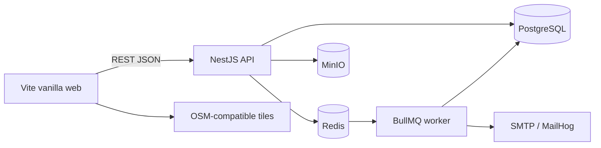
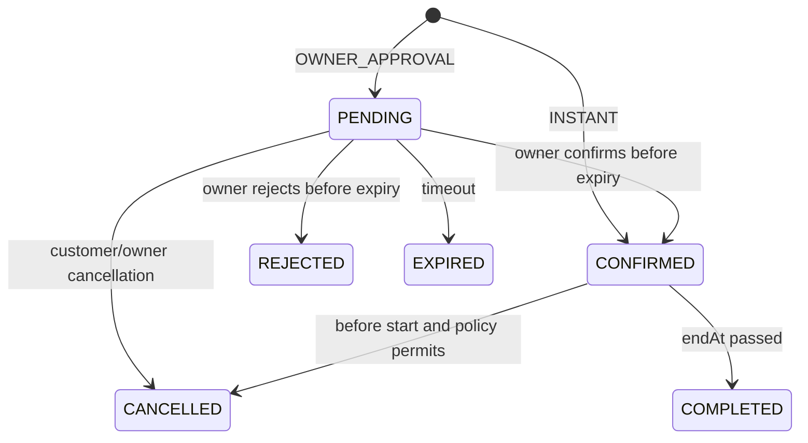

# Đặc tả thiết kế Sports Booking Platform MVP

**Ngày:** 2026-09-08
**Trạng thái:** Đã phê duyệt theo `prompt.md`
**Phạm vi:** MVP chạy local tại Thành phố Hồ Chí Minh

## 1. Mục tiêu và nguyên tắc

Hệ thống cho phép khách công khai tìm địa điểm và lịch trống, khách đã đăng nhập đặt một loại sân, chủ sân quản lý tài nguyên và booking, admin thực hiện xét duyệt và kiểm duyệt. Một tài khoản có thể có nhiều vai trò. PostgreSQL là nguồn dữ liệu bền vững; Redis chỉ phục vụ queue/cache.

MVP dùng modular monolith để giữ transaction booking trong một database và giảm độ phức tạp vận hành. API và worker là hai process trong cùng monorepo. Front-end là Vite với HTML/CSS/JavaScript ES modules, không dùng framework SPA.

## 2. Quyết định và giả định

- Public được tìm kiếm, xem venue và availability; tạo hoặc quản lý booking cần đăng nhập.
- Số điện thoại bắt buộc, chuẩn hóa thành E.164 (`+84...`) và kiểm tra định dạng; không OTP trong MVP.
- Bước thời gian 30 phút; booking từ 60 phút đến 4 giờ và phải tạo trước ít nhất 60 phút.
- Dữ liệu thời gian lưu UTC; quy tắc lịch và hiển thị dùng `Asia/Ho_Chi_Minh`.
- VND lưu số nguyên; `pricePerSlot` là giá cho một đoạn 30 phút.
- JWT access token 15 phút; refresh session xoay vòng, hash token trong database, thời hạn 7 ngày.
- Booking đã kết thúc được worker tự chuyển `COMPLETED`; owner vẫn có thể hủy trước giờ bắt đầu và phải ghi lý do.
- Khu vực hành chính lưu dưới dạng bảng `areas` có `code`, `name`, `type` và quan hệ cha tùy chọn. Seed phản ánh dữ liệu demo, không hard-code quận/huyện vào schema.
- Email dùng MailHog local; ảnh dùng MinIO; bản đồ dùng Leaflet và tile OpenStreetMap qua cấu hình adapter.

## 3. Kiến trúc runtime



Các module NestJS được nhóm theo domain: `auth`, `users`, `owner-applications`, `venues`, `catalog` (sports/offerings/courts/amenities), `scheduling`, `pricing`, `availability`, `bookings`, `notifications`, `admin`, `audit-logs`, `storage`, và `health`. Controller chỉ chuyển DTO sang application service. Prisma repository và external adapter nằm sau service để unit test không cần infrastructure.

## 4. Domain và ranh giới module

- **Identity:** user, role, refresh session, account lock; cấp principal cho guard.
- **Owner onboarding:** application và quyết định admin; approval cấp role trong cùng transaction.
- **Venue catalog:** venue, moderation status, ảnh, tiện ích, sport offering và physical court; mọi write kiểm tra ownership.
- **Scheduling/pricing:** giờ mở cửa, closure và pricing rule. Pricing engine chia `[startAt,endAt)` thành đoạn 30 phút và đòi hỏi mỗi đoạn có đúng một rule.
- **Availability/booking:** kiểm tra chính sách, chọn court, giữ chỗ, state transition, cancellation và reassignment.
- **Notifications:** tạo in-app notification và transactional outbox event trong cùng transaction nghiệp vụ; relay idempotent đẩy event sang BullMQ.
- **Admin/audit:** lock user, xét duyệt owner/venue và ghi actor, action, resource, before/after metadata.

## 5. Luồng booking và chống double booking

1. API xác thực user và canonicalize request. Bản ghi idempotency gồm `(actorId, scope, key, requestHash)`; cùng key/cùng hash replay response, cùng key/khác hash trả `IDEMPOTENCY_KEY_REUSED`.
2. Parse thời gian ISO, chuẩn hóa UTC và pre-validate để fail nhanh. Đây không phải authoritative validation.
3. Mở transaction `Serializable` với retry tối đa ba lần cho serialization/deadlock failure.
4. Khóa venue rồi offering; đọc lại moderation, operating hours, offering policy và pricing rules.
5. Expire stale holds bằng service chung, sau đó chọn candidate court active theo thứ tự ổn định và khóa bằng `FOR UPDATE SKIP LOCKED`.
6. Khi đã khóa court, authoritative validation đọc lại court state, venue/court closures, lead/advance policy và tính lại price snapshot ngay trong transaction.
7. Mọi mutation schedule, price, closure, venue moderation và court state cũng khóa resource theo thứ tự venue → offering → court. Tạo closure/disable court bị từ chối nếu còn `PENDING`/`CONFIRMED` tương lai; owner phải reassign/cancel trước.
8. Expiration service chạy `UPDATE ... WHERE status='PENDING' AND expires_at <= statement_timestamp() RETURNING ...`, đồng thời ghi history, in-app notification và outbox. Confirm/reject dùng `expires_at > statement_timestamp()` nên race chỉ có một transition thắng.
9. Với `OWNER_APPROVAL`, insert `PENDING`, `occupiesCourt=true`, `expiresAt=statement_timestamp() + interval '30 minutes'`; với `INSTANT`, insert `CONFIRMED`, `occupiesCourt=true`.
10. PostgreSQL exclusion constraint trên `(court_id WITH =, tstzrange(start_at,end_at,'[)') WITH &&)` chỉ áp dụng khi `occupies_court = true`.
11. Database `CHECK` bắt buộc `occupies_court = (status IN ('PENDING','CONFIRMED'))`; `court_id` luôn non-null. Khi reject/cancel/expire/complete, status và flag đổi atomically.
12. Nếu worker trễ, create/search gọi cùng expiration service trước khi tính capacity. Stale `PENDING` vẫn giữ constraint cho tới transaction chuyển nó sang `EXPIRED`, nên không có cửa sổ cấp trùng.

Exclusion constraint chỉ chống booking-booking; locking protocol bảo vệ booking trước thay đổi lịch, giá, closure, moderation và maintenance. Các integration test chạy đồng thời booking với từng loại mutation quan trọng.

## 6. State machine



Mọi transition bất hợp lệ trả `BOOKING_INVALID_TRANSITION`. Update luôn có expected status và điều kiện expiry; history, notification và outbox được ghi cùng transaction. Test race confirm-vs-expire, reject sau hạn và worker lặp/trễ.

## 7. Mô hình dữ liệu

Chi tiết quan hệ nằm tại [erd.md](./erd.md). Các snapshot quan trọng trên booking gồm `priceAmount`, `currency`, `slotMinutes`, `cancellationNoticeMinutes`, `confirmationMode`, và `pricingBreakdown` JSON. `priceAmount` được serialize thành JSON number vì MVP giới hạn giá dưới `Number.MAX_SAFE_INTEGER`, dù PostgreSQL dùng `bigint`.

Operating/pricing windows dùng `startMinute`/`endMinute` (0–1440) theo giờ địa phương và `weekday` 1–7. Một ngày có nhiều window không overlap. MVP không hỗ trợ window qua nửa đêm và booking không được qua business date; owner tách lịch ở hai ngày. PostgreSQL `int4range('[)')` exclusion constraint chống pricing rule overlap theo `(offeringId, weekday)`.

Venue status là `DRAFT → PENDING_APPROVAL → APPROVED|REJECTED`, `APPROVED → HIDDEN`, và owner có thể sửa/resubmit về `PENDING_APPROVAL`. Việc sửa venue đã duyệt tạm gỡ venue khỏi public cho tới lần duyệt mới. Hide không tự hủy booking đã có nhưng chặn booking mới. Không dùng boolean visibility độc lập với status.

PATCH một venue `APPROVED` chuyển ngay sang `PENDING_APPROVAL`; draft/rejected cần action `submit`. “Delete” venue/offering/court là archive/inactivate, không hard-delete. Archive bị từ chối nếu còn booking tương lai đang chiếm sân.

Reassignment khóa old và target court theo UUID tăng dần để tránh deadlock, sau đó bắt buộc target cùng offering (suy ra cùng venue/sport), active và không overlap. Composite foreign key và exclusion constraint vẫn là lớp bảo vệ cuối; concurrency tests chạy reassign song song với booking và disable court.

## 8. API và lỗi

REST dùng prefix `/api/v1`; Swagger tại `/docs`. List dùng `page`, `pageSize` (tối đa 100), whitelist `sort`. Error envelope:

```json
{
  "code": "BOOKING_NO_CAPACITY",
  "message": "Không còn sân trống trong khoảng thời gian đã chọn.",
  "details": {},
  "requestId": "01J..."
}
```

Contract chi tiết ở [api-contract.md](./api-contract.md), ma trận quyền ở [authorization-matrix.md](./authorization-matrix.md).

## 9. Error handling và observability

- Global validation pipe từ chối property lạ; exception filter chuyển lỗi domain sang HTTP nhất quán.
- Request ID được nhận hoặc sinh mới, trả qua header và log JSON.
- Không log password/token; production không trả stack trace.
- Booking/in-app notification/outbox commit atomically. Outbox relay claim event bằng lock, enqueue BullMQ với deterministic job ID rồi đánh dấu dispatched; completed jobs được giữ đủ lâu để dedupe relay retry.
- Worker lưu `processed_event` theo event ID trước/đồng transaction với database side effect. SMTP là at-least-once: crash sau SMTP accept nhưng trước acknowledge có thể gửi lặp; email luôn chứa stable event reference để quan sát/dedupe ở provider khi provider hỗ trợ.
- Queue có retry hữu hạn với exponential backoff và lưu `lastError`; lỗi email không rollback booking.
- Health kiểm tra process; readiness kiểm tra PostgreSQL và Redis.

## 10. Kiểm thử và tiêu chí chất lượng

- Unit: state policy, phone normalization, pricing segmentation, interval/policy validation.
- Integration với PostgreSQL thật: constraint, transaction, refresh rotation, ownership và audit.
- Concurrency: bắn đồng thời nhiều booking hơn số court; số thành công đúng capacity, không có overlap. Kiểm tra riêng boundary 10:00/10:00 và pending hết hạn khi worker chưa chạy.
- API E2E: auth, owner application, venue approval, public search, booking lifecycle.
- Browser E2E: critical customer/owner/admin paths.
- Mỗi phase phải qua test liên quan, lint, typecheck và build; Phase 11 chạy Docker clean-start smoke test.

## 11. Bảo mật

Argon2 hash password và refresh token; rotation phát hiện token reuse và revoke session family. JWT chứa `securityVersion`; guard của mọi protected request đọc user hiện tại và từ chối nếu locked hoặc version không khớp. Lock user tăng version và revoke mọi refresh session.

Access token chỉ giữ trong memory của web app. Refresh cookie là HttpOnly, `SameSite=Strict`, `Path=/api/v1/auth`, và `Secure` ở production. MVP deploy same-origin; refresh/logout kiểm tra `Origin`, CORS dùng allowlist và không dùng wildcard với credentials. Role guard luôn đi kèm ownership policy. API không nhận authoritative `ownerId`, `courtId` hay price. Auth endpoints có rate limit. Upload kiểm tra MIME, kích thước và object key server-generated. Admin action quan trọng luôn tạo audit log.

## 12. Ngoài phạm vi

Không triển khai payment/refund, ticket, QR, chat, coupon, loyalty, review, settlement, native mobile hay microservices. Không tạo module placeholder cho các phần này.
