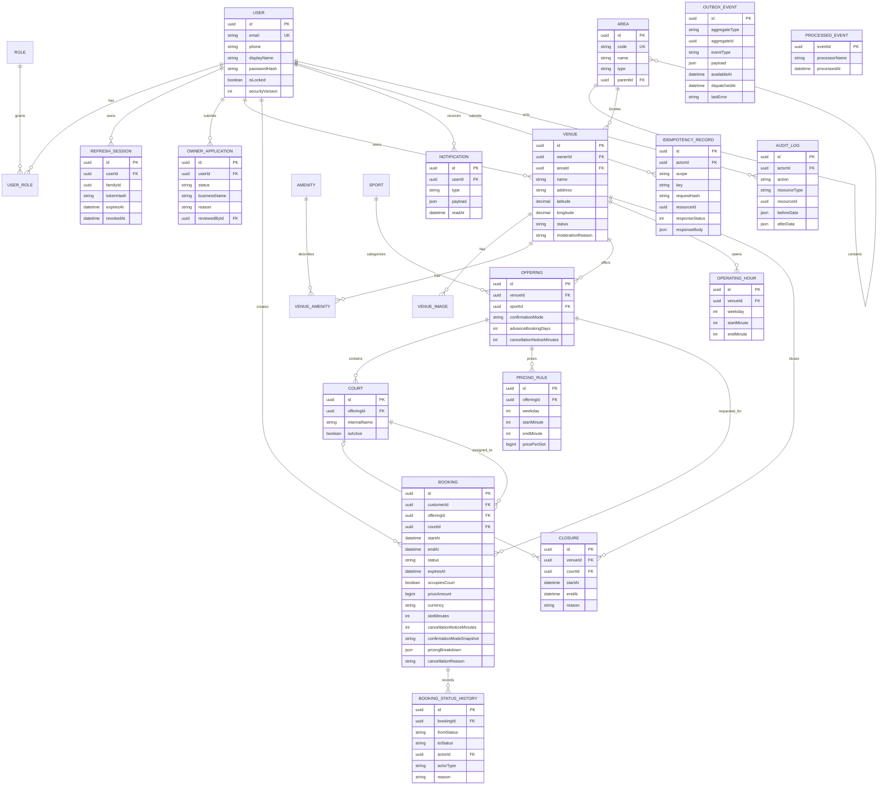

# ERD và integrity rules của MVP

## Database invariants và index

- `users.email` lưu lowercase và unique; `roles.name` unique; `(user_id, role_id)` unique.
- Chỉ một owner application active (`PENDING`) trên mỗi user.
- `(venue_id, sport_id)` unique; `(offering_id, internal_name)` unique; `courts` có unique `(id, offering_id)` để booking dùng composite foreign key `(court_id, offering_id)`.
- `start_minute >= 0`, `end_minute <= 1440`, `start_minute < end_minute`; operating windows cùng venue/weekday không overlap.
- Pricing dùng exclusion constraint `(offering_id WITH =, weekday WITH =, int4range(start_minute,end_minute,'[)') WITH &&)`.
- Booking yêu cầu `start_at < end_at`, `court_id NOT NULL`, và `occupies_court = (status IN ('PENDING','CONFIRMED'))`.
- Booking dùng exclusion constraint `(court_id WITH =, tstzrange(start_at,end_at,'[)') WITH &&) WHERE (occupies_court)`.
- `(actor_id, scope, key)` unique cho idempotency; cùng key khác `request_hash` bị service từ chối.
- Outbox có index `(dispatched_at, available_at)`; notification có index `(user_id, read_at, created_at)`; mọi foreign key/filter chính có index.
- History có `actorType=USER|SYSTEM`; `actorId` nullable và chỉ bắt buộc với actor USER. Expiration/completion dùng SYSTEM.
- Mọi bảng nghiệp vụ có `createdAt`, `updatedAt` khi phù hợp. Migration bật extension `btree_gist` trước các exclusion constraint.
